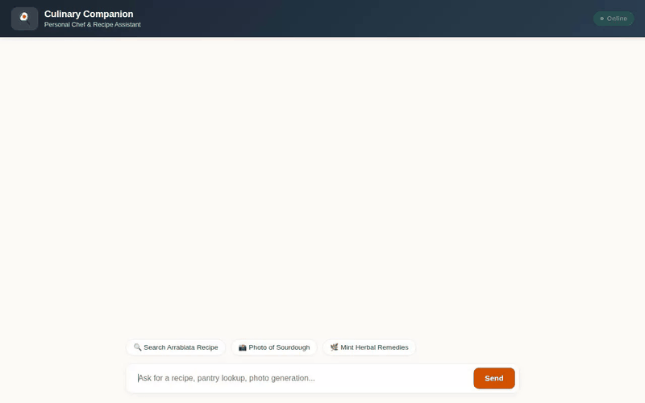

# 🍳 Culinary Companion

A conversational AI agent built with the **Google Agent Development Kit (ADK)** that serves as a personal chef, meal planner, and smart kitchen assistant.



---

## 🌟 Capabilities & Features

**Culinary Companion** is an intelligent assistant designed to help home cooks discover recipes, manage pantry inventory, research culinary herbs, and generate rich visual cards and media artifacts.

### 🍱 1. Interactive Recipe Discovery & A2UI Cards
* **External Recipe Catalog Search**: Searches external recipe databases (TheMealDB) for dishes based on ingredients or cuisine names.
* **A2UI Rich Card Rendering**: Emits A2UI (Agent-to-User Interface v0.8) schema messages that render natively in the chat UI as styled recipe cards with images, instructions, and ingredients.

### 📦 2. Real-Time Pantry Inventory (Google Cloud Firestore)
* **Pantry Management**: Allows users to check, add, and remove ingredient stock directly in **Google Cloud Firestore**.
* Real-time queries to track available ingredients before suggesting recipes.

### 📸 3. Multimodal Media Generation & Hosting (Vertex AI & Cloud Storage)
* **Dish Image Generation**: Uses `gemini-3.1-flash-lite-image` and `imagen-3.0-generate-002` to generate high-resolution photos of plated dishes.
* **Culinary Video Generation**: Uses Google's Omni model (`gemini-omni-flash-preview`) in the global region to generate short culinary videos.
* **Public Artifact Hosting**: Automatically saves generated images and videos as agent artifacts and uploads raw bytes directly to **Google Cloud Storage** buckets, returning public HTTPS URLs for inline UI display.

### 🌿 4. Culinary & Herbal Knowledge Base (Vertex AI RAG Engine)
* Grounded in a serverless **Vertex AI RAG Engine** corpus containing authentic culinary and medicinal herb documentation (Project Gutenberg Culinary Herbs).
* Provides verified guidance on herb pairings, digestion remedies, and culinary preparations.

### 🧠 5. Cross-Session Memory (Vertex AI Memory Bank)
* Uses **Vertex AI Memory Bank** with `PreloadMemoryTool` and post-session memory callbacks.
* Remembers user dietary preferences (e.g., vegan, low-carb) and severe food allergies across sessions so recipe suggestions automatically adapt.

### 🐍 6. Python Code Execution Sandbox
* Equipped with `AgentEngineSandboxCodeExecutor` to execute Python code safely inside an Agent Engine sandbox for scaling recipe serving sizes, unit conversions, and nutritional calorie/macro calculations.

---

## 🏗️ Architecture & Cloud Infrastructure

* **Framework**: Google Agent Development Kit (ADK) with `Gemini 2.5 Flash`
* **Pantry Store**: Google Cloud Firestore (`google-cloud-firestore`)
* **Media Storage**: Google Cloud Storage (`google-cloud-storage`)
* **Knowledge Retrieval**: Vertex AI RAG Engine
* **Long-Term Memory**: Vertex AI Memory Bank
* **Code Execution**: Agent Engine Sandbox Code Executor
* **Frontend**: FastAPI A2A Proxy + Single Page Chat UI with native A2UI HTML renderer

---

## 🚀 Local Setup & Running Instructions

### Prerequisites
* Python 3.11+
* Google Cloud project with Vertex AI, Firestore, and Cloud Storage APIs enabled
* `gcloud` CLI authenticated (`gcloud auth application-default login`)

### 1. Environment Configuration
Ensure your environment variables are set or configured in your deployment metadata:
```bash
export AGENT_ENGINE_RESOURCE_NAME="projects/<PROJECT_ID>/locations/<LOCATION>/reasoningEngines/<REASONING_ENGINE_ID>"
export AGENT_DIRECTORY="app"
export PORT=8080
```

### 2. Install Dependencies
```bash
uv pip install -r requirements.txt
```

### 3. Start Local Frontend Proxy & Chat UI
Run the FastAPI frontend server:
```bash
uv run python frontend/main.py
```
Open your browser and navigate to the port specified in `PORT` (e.g., `8080`) on your machine to interact with the Culinary Companion agent.
